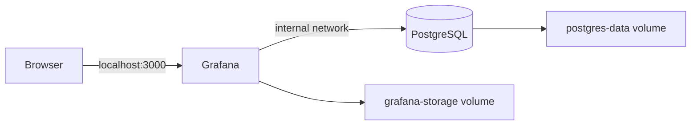

# Grafana and PostgreSQL infrastructure lab

A personal Docker Compose lab by Eduardo Branco for running Grafana with PostgreSQL as its application database. It demonstrates container configuration, persistent storage, environment variables, and dependency readiness. No dashboards, data sources, or production performance claims are included.

## Architecture



PostgreSQL stores Grafana application metadata; it is not automatically a configured monitoring data source. The database has no published host port. The UI is bound to loopback for local use. The Dockerfile inherits the official Grafana startup behavior.

## Run locally

Prerequisites: Git, Docker Engine or Docker Desktop with Linux containers, and Docker Compose v2.

```sh
git clone https://github.com/Ehbranco/grafana.git
cd grafana
```

Set two different strong passwords in your current shell. Do not put real credentials in source files.

PowerShell:

```powershell
$env:GRAFANA_DB_PASSWORD = Read-Host "Local database password"
$env:GRAFANA_ADMIN_PASSWORD = Read-Host "Local Grafana admin password"
```

Bash:

```bash
read -rsp "Local database password: " GRAFANA_DB_PASSWORD
export GRAFANA_DB_PASSWORD
printf "\n"
read -rsp "Local Grafana admin password: " GRAFANA_ADMIN_PASSWORD
export GRAFANA_ADMIN_PASSWORD
printf "\n"
```

```sh
docker compose config --quiet
docker compose up -d --build
docker compose ps
docker compose logs --tail=100 postgres grafana
```

Open http://localhost:3000. For a fresh database, sign in as `admin` using the password you selected. The database must pass its readiness check before Grafana starts.

## Check and troubleshoot

- Missing variables: Compose exits with a helpful message before starting containers. Set both variables in the same terminal.
- UI unavailable: inspect `docker compose ps` and service logs; check that port 3000 is free.
- PostgreSQL readiness is checked with `pg_isready`; it does not prove Grafana is healthy.
- Existing volumes: environment variables do not rotate existing database or Grafana admin passwords. Preserve the existing credentials or use the documented application/database password reset procedure. Back up data before changes.
- Stop with `docker compose down`; named volumes persist. `docker compose down -v` permanently deletes lab data and is not needed for a normal shutdown.

## Validation and limitations

The Compose configuration passed `config --quiet` with temporary validation values. Container startup has not been verified during this revision because the local Docker daemon was unavailable.

This is a learning lab, not a production deployment. The original PostgreSQL 13 major version is retained to avoid an implicit upgrade of existing data volumes; plan and test migration to a supported version before further use. Grafana still uses the original `latest` tag. Pin a tested image version or digest and check database compatibility before upgrading.

TLS, managed secrets, backup/restore exercises, provisioned data sources, and dashboard screenshots are future work. Environment variables keep passwords out of committed code but are not a secret vault. Do not publish this lab directly on the internet.

## References

- [Grafana Docker installation](https://grafana.com/docs/grafana/latest/setup-grafana/installation/docker/)
- [Compose startup order](https://docs.docker.com/compose/how-tos/startup-order/)
- [Compose variables](https://docs.docker.com/compose/how-tos/environment-variables/variable-interpolation/)

## Author

[Eduardo Castello Branco](https://www.linkedin.com/in/eduardohbranco/) — networks, infrastructure, and cloud labs.
